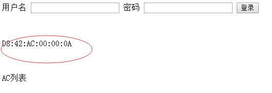

## asp.net的基本运用

## explain

需求需要运用到asp.net创建网站,调用mssql,能很好的调用webservice接口。所以需要学习asp.net.

## solution

win7 安装 visual studio 2012,书籍看 c#高级编程第8版(39章)

## step

1. 下载c#高级编程第8版，阅读第39章

2. 安装visual studio 2012

   安装方法，进入www.itellyou.com,选择visual studio 2012 ultimate ,复制连接用迅雷下载，

   解压出来，点击exe进行运行安装，才不会出现无法找到包源的错误。

3. 创建基本的asp.net网页

   [http://bbs.csdn.net/topics/390314988](http://bbs.csdn.net/topics/390314988)

   ​

4. 连接mssql

5. 执行查询sql

   [http://blog.csdn.net/ityanping/article/details/6631019](http://blog.csdn.net/ityanping/article/details/6631019)

   [http://www.cnblogs.com/ngnetboy/archive/2012/03/26/2417342.html](http://www.cnblogs.com/ngnetboy/archive/2012/03/26/2417342.html)

6. 用iis发布。

   用管理员身份打开visual studio 2012,在项目名右键点击生成-发布网站，将网站发布到不同的文件目录下，在iis新建网站，目录选择为相同的目录，在应用池中设置网站的.netframework为4.0

## show time

***

last update 2016-10-14

