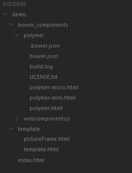
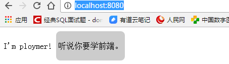

## ploymer (一) 第一个demo 

* 安装node

* 安装bower

  >npm install -g bower

* 初始项目

  * 创建文件夹demo

  * bower install polymer

  * 增加index.html

    ```
    <head>
        <meta charset="UTF-8">
        <title>Document</title>
        <!-- 这是一个基础版的兼容库 -->
        <script src="./bower_components/webcomponentsjs/webcomponents-lite.min.js"></script>
        <!-- 将rel修改为import可以引入另外一个HTML，它将会被执行 -->
        <link rel="import" href="./template/template.html">
        <link rel="import" href="./template/pictureFrame.html">
    </head>
    <body>
    	<proto-element></proto-element>
    	<picture-frame>
      <p>听说你要学前端。</p>
    </picture-frame>
    </body>

    ```

  * 增加template和pictureFrame

    > template.html

    ```
    <link rel="import" href="../bower_components/polymer/polymer.html">
    <script>
      Polymer({
        is: "proto-element",
        ready: function() {
          this.textContent = "I'm ploymer!"
        }
      });
    </script>
    ```

    > pictureFrame.html

    ```
    <link rel="import" href="../bower_components/polymer/polymer.html">
    <dom-module id="picture-frame">

      <template>
        <style>
          div {
            display: inline-block;
            background-color: #ccc;
            border-radius: 8px;
            padding: 4px;
          }
        </style>
        <div>
          <content></content>
        </div>
      </template>

      <script>
        Polymer({
          is: "picture-frame",
        });
      </script>

    </dom-module>
    ```

* 项目文件结构

​     


* 发布项目到tomcat

  > 修改tomcat的conf/server.xml

  ```
   <Host appBase="webapps" autoDeploy="true" name="localhost" unpackWARs="true">
        <Context docBase="E:/help/work/ploymer/demo" path="" debug="0"  reloadable="true"/>
      </Host>
  ```

* 运行tomcat 

  > http://localhost:8080/

  