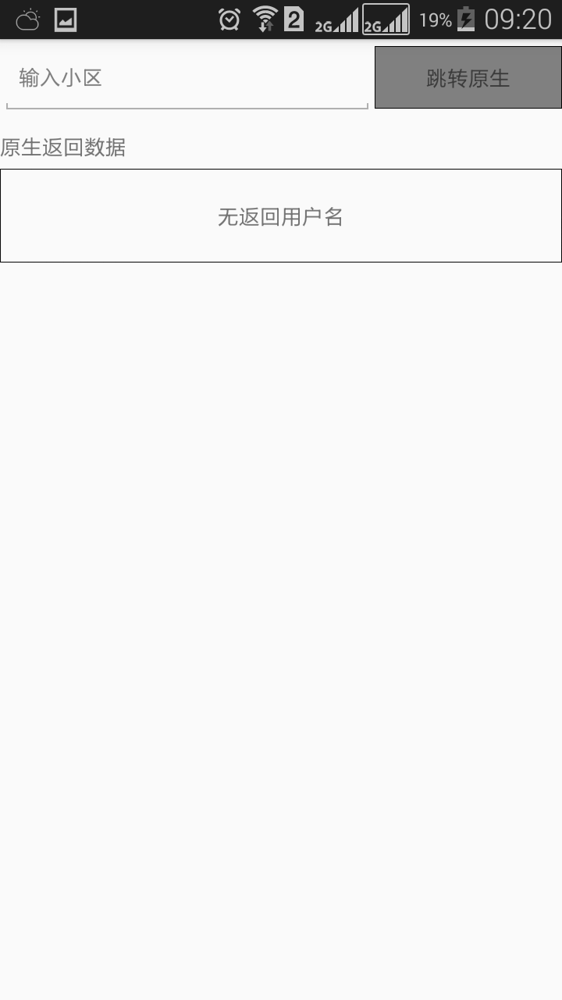
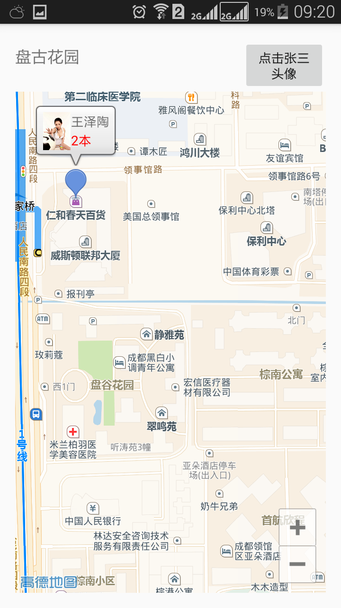
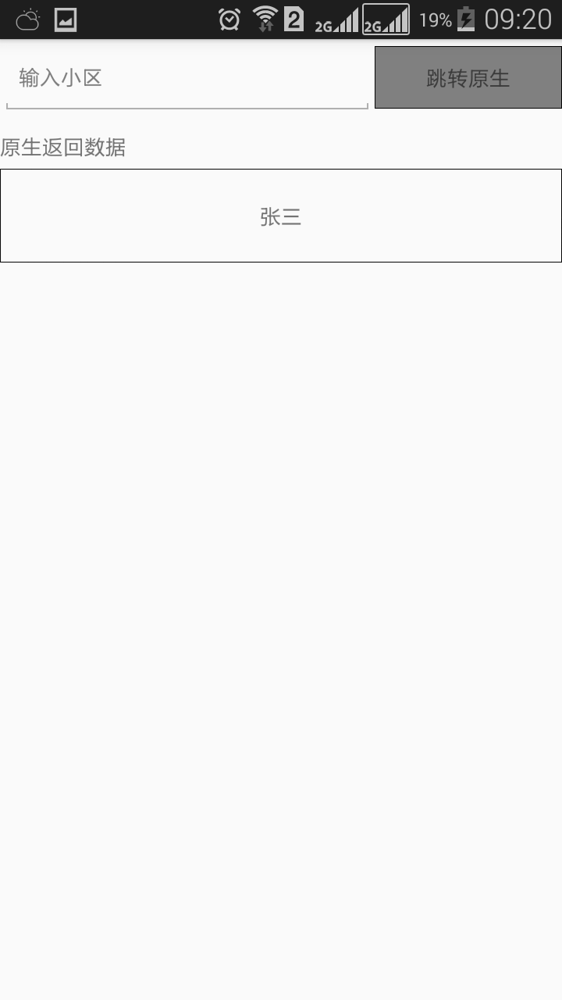

## react-native 与高德地图(amap)原生互相调用

##explain
在react-native 与原生互相调用篇章中说了怎么调用原生界面。想具体到怎么调用amap的原生界面。

##accent
	1.申请,配置key;
	2.app/libs 下面增加Amap的相关的jar,注意删除support.v4包，在项目app/build.gradle 已经默认加入了support:appcompat-v7包，其中包含了v4包。
	3：只上MapActivity的原生代码，原生交互的请看react-native 与原生互相调用
    4：推荐看androi推荐书籍
[http://hukai.me/android-training-course-in-chinese/index.html](http://hukai.me/android-training-course-in-chinese/index.html)

##code
	1.MapActivity.java

```
public class MapActivity extends AppCompatActivity implements AMap.OnMarkerClickListener,AMap.OnInfoWindowClickListener,AMap.InfoWindowAdapter {
        static final CameraPosition cameraPosition=new CameraPosition.Builder().target(new LatLng(30.62275,104.068573))
                .zoom(18).bearing(0).tilt(30).build();
        private AMap aMap;
        private SupportMapFragment aMapFragment;
    public final  static String EXTRA_PERSONNAME="com.demo.MapActivity.personname";
    @Override
    protected void onCreate(Bundle savedInstanceState) {
        super.onCreate(savedInstanceState);
        setContentView(R.layout.activity_map);
        TextView view=(TextView)findViewById(R.id.section);
        Intent intent=getIntent();
        String sectionName=intent.getStringExtra(MyMapIntentModule.EXTRA_SECTIONNAME);
        view.setText(sectionName);

        init();

    }

    private void init(){
        AMapOptions aOptions=new AMapOptions();
        aOptions.zoomGesturesEnabled(false);
        //aOptions.scrollGesturesEnabled(false);
        aOptions.camera(cameraPosition);
        if(aMapFragment==null ){
            aMapFragment=SupportMapFragment.newInstance(aOptions);
            FragmentTransaction fragmentTransaction=getSupportFragmentManager().beginTransaction();
            fragmentTransaction.add(R.id.fragment_container,aMapFragment,"map");
            fragmentTransaction.commit();
        }
    }


    public void clickPerson(View view){
        Intent intent =new Intent(this,MainActivity.class);
        intent.putExtra(EXTRA_PERSONNAME,"张三");
      startActivity(intent);

    }
    @Override
    protected  void onResume(){
        super.onResume();
        initMap();
    }
    private void initMap(){
        if(aMap==null){
            aMap=aMapFragment.getMap();
            setUpMap();
        }
    }
    private void setUpMap(){
        aMap.setOnMarkerClickListener(this);
        aMap.setOnInfoWindowClickListener(this);
        aMap.setInfoWindowAdapter(this);
        addMarkersToMap();   //
    }
    private void addMarkersToMap(){
        drawMarkers();
    }
    @Override
    public View getInfoWindow(Marker marker) {
        View view  = getLayoutInflater().inflate(R.layout.activity_marker,null);
        ImageView image = (ImageView)view.findViewById(R.id.image);
        TextView info = (TextView)view.findViewById(R.id.info);
        TextView orderNumber=(TextView)view.findViewById(R.id.orderNumber);
        orderNumber.setText("2本");
        orderNumber.setTextColor(Color.parseColor("#FF0000"));
        info.setText(marker.getTitle());


        return view;
    }

    @Override
    public View getInfoContents(Marker marker) {
        return null;
    }

    public void drawMarkers(){
        MarkerOptions markerOptions=new MarkerOptions();
        Marker marker=aMap.addMarker(markerOptions.position(new LatLng(30.624722,104.067533)).title("王泽陶")
                .draggable(true));
        marker.showInfoWindow();

    }

    @Override
    public void onInfoWindowClick(Marker marker) {
        System.out.println("点击了输入框");
    }
    @Override
    public boolean onMarkerClick(Marker marker) {
        System.out.println("点击了图标");
        return false;
    }

}
```

	2.activity_map.xml

```
<?xml version="1.0" encoding="utf-8"?>
<LinearLayout xmlns:android="http://schemas.android.com/apk/res/android"
    xmlns:tools="http://schemas.android.com/tools"
    android:layout_width="match_parent"
    android:layout_height="match_parent"
    android:paddingBottom="@dimen/activity_vertical_margin"
    android:paddingLeft="@dimen/activity_horizontal_margin"
    android:paddingRight="@dimen/activity_horizontal_margin"
    android:paddingTop="@dimen/activity_vertical_margin"
    tools:context="com.demo.MapActivity"
    android:orientation="vertical"
    >

    <LinearLayout
        android:layout_width="match_parent"
        android:layout_height="wrap_content"
        android:orientation="horizontal">

        <TextView
            android:width="0dp"
            android:layout_weight="1"
            android:layout_width="wrap_content"
            android:layout_height="wrap_content"
            android:textAppearance="?android:attr/textAppearanceMedium"
            android:id="@+id/section"
            />

        <Button
            android:width="0dp"
            android:layout_width="wrap_content"
            android:layout_height="wrap_content"
            android:text="点击张三头像"
            android:id="@+id/button"
            android:onClick="clickPerson"
            />
    </LinearLayout>

    <FrameLayout
        android:id="@+id/fragment_container"
        android:layout_width="match_parent"
        android:layout_height="fill_parent">
        </FrameLayout>


</LinearLayout>

```

	3.activity_marker.xml

```
<?xml version="1.0" encoding="utf-8"?>
<LinearLayout xmlns:android="http://schemas.android.com/apk/res/android"
    android:layout_width="match_parent"
    android:layout_height="match_parent"
    android:orientation="horizontal" >
 <ImageView
     android:src="@drawable/personimg"
     android:id="@+id/image"
     android:layout_width="30dp"
     android:layout_height="40dp"
     />
<LinearLayout
    android:layout_width="match_parent"
    android:layout_height="match_parent"
    android:orientation="vertical">
    <TextView
        android:id="@+id/info"
        android:layout_weight="1"
        android:layout_width="match_parent"
        android:layout_height="0dp"/>

    <TextView
        android:id="@+id/orderNumber"
        android:layout_weight="1"
        android:layout_width="match_parent"
        android:layout_height="0dp"
/>
</LinearLayout>


</LinearLayout>
```

##show 
	1.reactnative界面


	2.原生界面


	3.reactnative返回界面


* * * 
last update 2016-09-21

