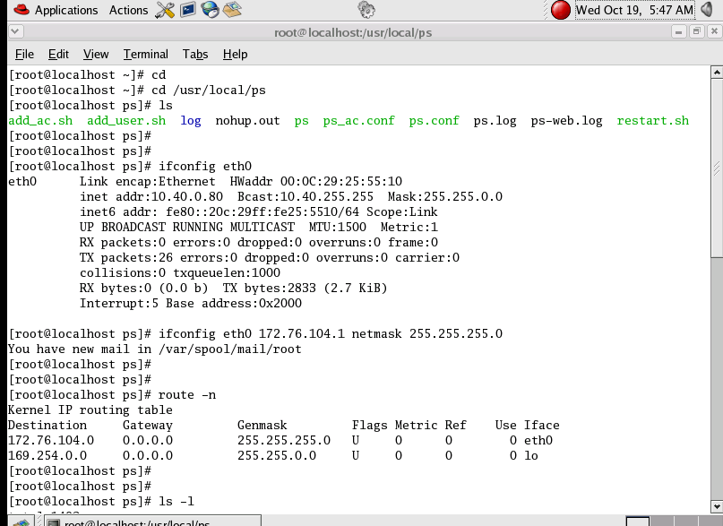
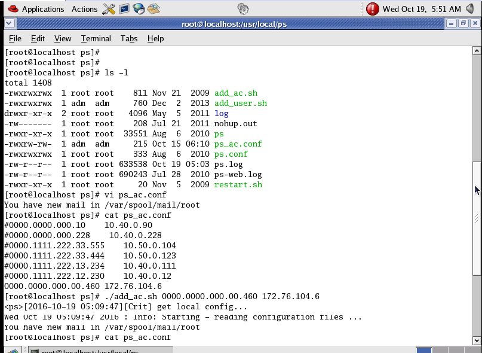
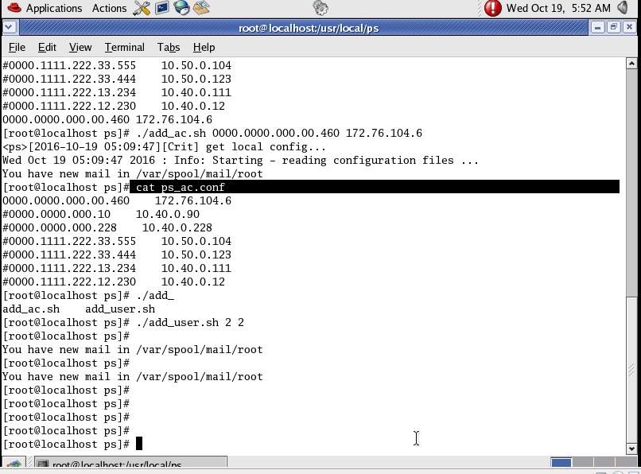
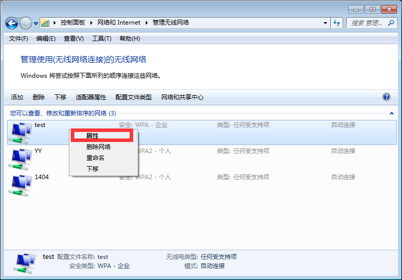
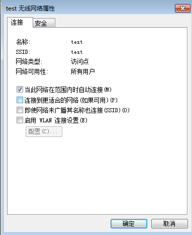
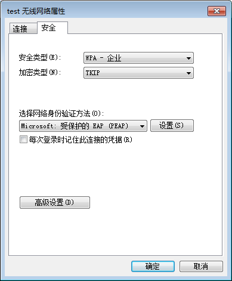
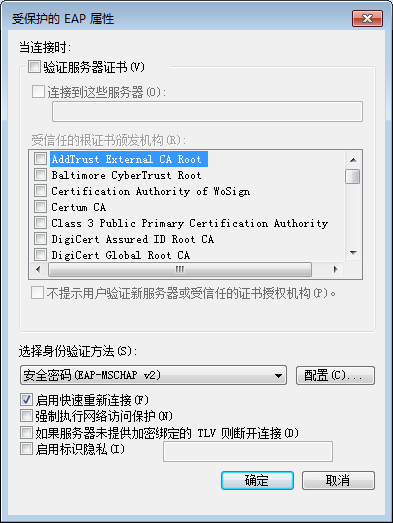
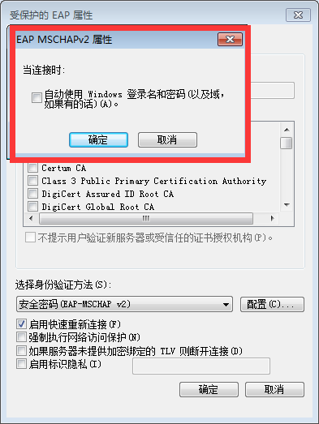
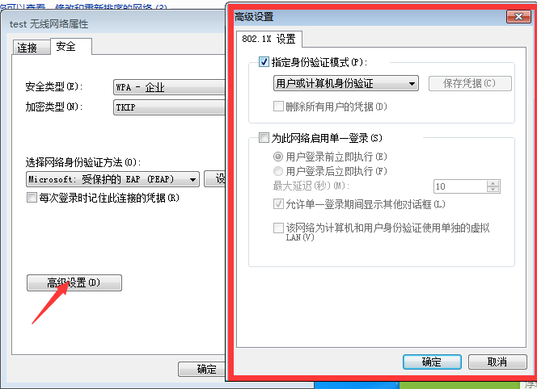
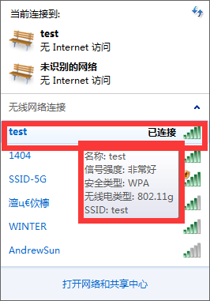

##802.1x认证

##question
对连接进入网络中的用户实现收费认证，怎么解决

##explain
客户端就是连接无线网络的电脑，设备端就是交换机，服务器就是装radius的电脑。

##step
	1.客户端发起验证，传送用户名
	2.设备端口为未授权
	3.请求radius服务md5加密方法
	4.设备将用户名，密码通过md5加密方法加密，传到radius
	5.radius服务进行验证开始计费。
	6.设备端口打开
	7.客户端正常通信


## resolution

最后的解决方案,采用寰创提供的已经加载的服务的redhat,在wm中加载虚拟机，在虚拟机中执行修改ip添加ac的网元码和lan口的ip;添加用户。客户端可以通过设置无线的设置添加无线网络，实现了802.1x验证。

- 基础环境  设置  ac的lan3口ip为 192.76.104.6   AC网元编码为 0000.0000.000.00.460(每一台AC的网元编码不同,登录AC进行查看)
- 本机的ip为 192.76.104.3    本机的虚拟的ip 为 192.76.104.1
- redhat 设置 (服务器设置好采取挂起的状态)

```
cd /usr/local/ps
ifconfig eth0
ifconfig eth0 172.76.104.1 netmask 255.255.255.0
route -n
vi ps_ac.conf
注释掉其余部分，添加0000.0000.000.00.460 172.76.104.6
cat ps_ac.conf
./add_ac.sh 0000.0000.000.00.460 172.76.104.6
cat ps_ac.conf
./add_user.sh 用户名   密码
```

图解










- 客户端连接wifi设置

  无线管理中添加需要连接的无线网络名

  ​

  

  ​

  ​

  

  ​

  ​

  ​

  ​

  

  ​

  ​

  ​

  

  ​

  ​

  

  ​

  ​

  ​

  





## atention

关闭电脑防火墙，关闭一切电脑安全软件。


## other

vi 编辑器使用。按Ins键进入编辑。编辑完成后退出保持 按ESC 后:wq! 保持后退出。

:q!未不保存再退出。

cat  filename 为查看命令。

##refs

[http://blog.csdn.net/lycb_gz/article/details/17523603](http://blog.csdn.net/lycb_gz/article/details/17523603)

[http://blog.csdn.net/happyfyshan/article/details/2332325](http://blog.csdn.net/happyfyshan/article/details/2332325)


------

update 2016-10-08

last update 2016-10-13