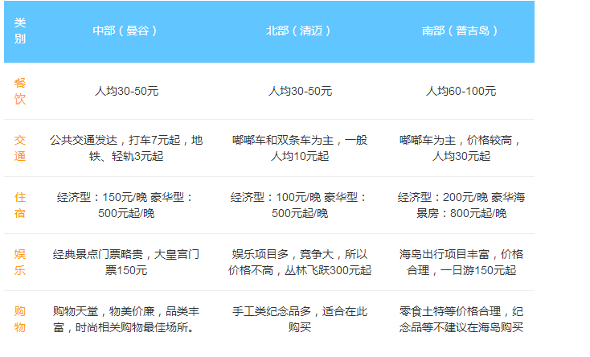

## 曼谷

时间  3.4---3.12(夏季)     共9天

流程看先南后北。先沙滩，后佛教。

预定的工具 ：淘宝 飞猪(板块)，春秋航空，携程，去哪儿网。

自由旅行社：东方旅行社自由行

策略：

接机，送机预约。

可以预约一日的行程。

攻略：

[http://www.16fan.com/](http://www.16fan.com/)

货币

泰铢（THB）是泰国官方货币，单位是“铢”，英文Baht，读音为“巴”。流通的有10、20、50、100、500及1000铢等五种面额的纸币和5、10、 20、50萨当及1、5、10铢七种铸币。1铢等于100萨当。

根据2016年6月汇率参考：

1元人民币≈5.37泰铢 

100泰铢≈18.61人民币

时差

勿忘将手表拨慢1小时。格林威治时间为12时，泰国时间为19时，北京时间为20时。 

消费

吃住

住宿：关门，关窗，钱分开放，确认酒店名称和位置。

出行：tutu车、出租车、包车

乘船注意行李安全，（贵重物品，和护照随身携带）

走路（注意财物和包包，，飞车党）

打车的时候一定要跟司机讲好价格（确定司机打表后再上车），另外泰国现在已经有UBER和

Grab Taxi的服务

打车最好要记下车牌号码 (1644 --交通)

注意小偷。

正规标志的Taxi   by meter  (避免黑车)

海岛游及浮潜

不要碰海底生物

骗术

不要理睬一切陌生人

礼仪

尤其玉佛寺佛堂内，绝对禁止拍照。进入佛寺参观，衣著要整齐，进入佛堂内，要脱帽脱鞋，禁止吸烟。

重要物品

把所有重要的文件，包括护照、签证页、保险等，复印上几份，和原件放在不同的地方。同时，扫描好所有的重要文件放在自己的邮箱里。即使行李全部丢了，只要能上网，就能找到需要的文件

景点

保险

出发之前买好保险。如果你在海外生病或者受伤，即使是一点小伤，也可能要付出高昂的费用。所以保险还是划算的，而且有时是办签证的必要条件

推荐美亚保险

语言

打个电话回酒店让酒店服务人员为你沟通。前往泰国旅游的游客行前先学几句重要泰语，十六番APP自带翻译功能，以备语言不通带来的麻烦

穿着

平时，短裤，短袖。在寺庙 长袖。

海边泳衣，比基尼。等

昼夜温差大

去泰国不建议带特别多衣服，因为在当地会买到很多特色风情的服饰首饰，而且价格都很便宜。

大使馆

（1）中国驻泰国大使馆

地址：NO.57, Racgadapisek Road, Bangkok

电话：+66-02-2450088

领事保护电话：+66-854833327（24小时值班手机），+66-02-2457010（工作日9：00-17：00）

（2）中国驻清迈总领事馆

地址：111 Changloh Road, Haiya District, Chiangmai

电话：+66-53-280380，+66-53-276125，+66-53-276457

（3）中国驻宋卡总领事馆（近普吉岛、苏梅岛、甲米）

地址：9 Sadao Road, Songkhla

电话：+66-74-322034

领事保护电话：+66-817665560

（4）中国驻宋卡总领馆驻普吉领事办公室

电话：+66-76-304219

领事保护电话：+66-945956168（中文、泰文），+66-945986859（中文）

（5）中国驻孔敬总领馆

地址：142/44 Moo 2，Rob-Bueng Rd.，Nai-Muang， Muang， Khon Kaen

电话：+66-43-226873

关于小费

而付小费是一种礼仪。没有硬性规定要给小费

20泰铢 

注意千万不能给硬币

有的餐馆有Service Charge，可不用给小费。

医疗

如感冒药、晕车药、创口贴等，以防万一

签证

行前办理、

- 护照

- 泰国成都大使馆

成都市航空路6号丰德国际广场3号楼12层

- 材料

存款证明(一万+户口复印件)

护照(直接带去)

照片不用单独准备

表格，只填一张，贴上照片即可，不用复印

- 签证申请表1张（可在泰国驻华大使馆网站下载）
- 由申请人本国单位或有关部门出具的担保信(英文或泰文)，注明申请人的姓名、赴泰目的(仅限中国公民)

入境

在飞机上，会发入境卡和出境卡。

入境卡

到达大厅，在移民局的柜台前排队

收走入境卡，将出境卡订在护照上。

都用英文，，签名用中文。

手机卡

Happy卡、Truemove卡以及AIS卡

00400+86+手机号

取现

下飞机  ATM  

取现建议使用借记卡（62）。消费使用信用卡

APP

十六番

uber

Speak Thai 

拜县[北]

佛教

清迈（北）[好]

沙滩     

沙美岛（中）

普吉_卡塔沙滩（南)[美]{人少}

普吉_皇帝岛(南)[好]

普吉_达柴岛(南)[好]

苏梅岛(南)[远离海岸]

人妖

芭提雅（中）

曼谷    1天

3.5------------------------

坐车到   芭提雅

3.6----------------

沙美岛

成都

11.10   出发    13:25   到

曼谷

曼古一天